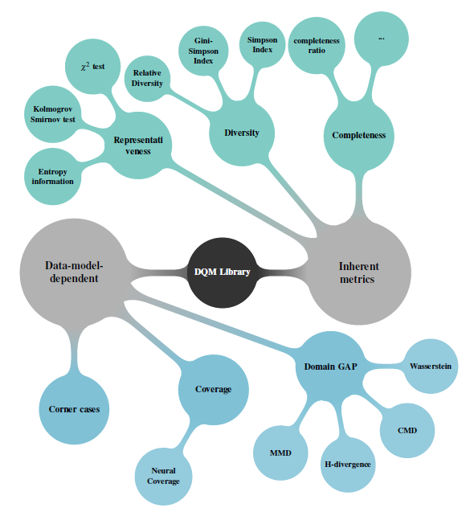

<div align="center">
    
    <h1 style="font-size: large; font-weight: bold;">DQM</h1>
</div>

<div align="center">
    <a href="#">
        
    </a>
    <a href="#">
        
    </a>
    <a href="#">
        
    </a>
    <a href="#">
        
    </a>
    <a href="#">
        

[](https://github.com/pylint-dev)
[](https://flake8.pycqa.org/en/latest/)

</div>

# Data_Quality_Metrics

Data Quality Metrics called **DQM** is a python library which computes three data inherent metrics and one data-model dependent metrics.

The data inherent metrics are (defintions from Confiance.ai program): 
- **Diversity** : Computes the presence in the dataset of all required information defined in the specification (requirements, Operational Design Domain (ODD) . . . ).
- **Representativeness** : is defined as the conformity of the distribution of the key characteristics of the dataset according to a specification (requirements, ODD.. . )
- **Completeness** : is defiend by the degree to which subject data associated with an entity has values for all expected attributes and related entity instances in a specific context of use.

The data-model dependent metrics are (definition from Confiance. ai program): 
- **Domain Gap** : In the context of a computer vision task, the Domain Gap (DG) refers to the difference in semantic, textures and shapes between two distributions of images and it can lead to poor performances when a model is trained on a given distribution and then is applied to another one.

[//]: # (- Coverage : The coverage of a couple "Dataset + ML Model" is the ability of the execution of the ML Model on this dataset to generate elements that match the expected space.)

For each metric, several approaches are developped to handle the maximum of data types. For more technical and scientific details, you can refer back to this [delivrable](https://catalog.confiance.ai/records/p46p6-1wt83/files/Scientific_Contribution_For_Data_quality_assessment_metrics_for_Machine_learning_process-v2.pdf?download=1)

## Project description
Several approches are developped as decscribed in the figure below.



In the current version, the approaches developped are: 
- Representativeness : 
  - $\chi^2$ goodness of fit test for uniform and normal distibutions. 
  - Kolmogorov Smirnov test for uniform and normal distributions. 
  - Granular and Relative Theorithecal Entropy GRTE proposed and developed in Confiance.ai program. 
- Diversity : 
  - Relative Diverity developed and implemented in Confiance.ai program
  - Gini-Simpson and Simposon indices. 
- Completeness : 
  - Ratio of filled inofrmation
- Domain Gap : 
  - MMD 
  - CMD 
  - Wasserstein 
  - H-Divergence
  - FID
  - Kullback-Leiblur MultiVariate Normal distribution

[//]: # (- Coverage : )

[//]: # (  - Approches developed in Neural Coverage &#40;NCL&#41; given [here]&#40;https://github.com/Yuanyuan-Yuan/NeuraL-Coverage&#41;. )

# Getting started 

## Set up a clean virtual environnement
Validated python version : 3.9.18

Linux setting:

```
pip install virtualenv
virtualenv myenv
source myenv/bin/activate
```

Windows setting:

```
pip install virtual env 
virtualenv myenv 
.\myenv\Scripts\activate
```

## Install the library (restricted access)

You can install it by a direct downloading from PyPi using the command 

````
pip install dqm
````

You can installing it from it github sources by launching the following command
````
https://github.com/IRT-SystemX/DataQualityMetrics
````
If you got the source code as a zip file, you can install the library from the root directory of the archive by typing : 
```
pip install .
```

## Usage

[//]: # (All validated and verified functions are detailed in the files **call_main.py**. )

For detailed informations about implemented metrics see the metrics dedied sections:
- Completness
- Diversity
- Domain Gap
- Representativeness

### Implented tests:
- All tests are implented by using VDP use case in the file *final-tests.ipynb* 
- For Completeness : 
  - import the metric <code> from dqm.completeness.metric import DataCompleteness </code>
  - call completeenss metric <code> completeness_evaluator = DataCompleteness() </code>
  - For the whole dataset (dataframe : df): 
    - <code> completeness_evaluator.completeness_tabular(df) </code>
  - for a specific column : 
    - <code> completeness_evaluator.data_completion(df['Car']) </code>
- For Representativness : 
  - import the metric <code> from dqm.representativeness.metric import DistributionAnalyzer </code>
  - For normal distribution : 
    - <code>analyzer = DistributionAnalyzer(df['Car'], 20, 'normal') </code>
    - $\chi^2$ test : 
      - <code> pvalue, intervals_frequencies = analyzer.chisquare_test() </code>, where the *pvalue* designe the probability value to accepte the null hypothesis and intervals_frenquecies details the theoretical and observed frenquecies in each bin. 
    - KS test : 
      - <code>ks_pvalue = analyzer.kolmogorov()</code>, where *ks_pvalue* is the pvlaue of the test. 
    - GRTE method : 
      - <code> grte_result, intervals_discretized = analyzer.grte() </code>
  
  These methods can include required normal paramters (mean and standard deviation)
  - The same code can be used for **uniform** distibution.  
- For diversity : 
  - import metric : <code>from dqm.diversity.metric import DiversityIndexCalculator </code>
  - call the function : <code>metric_calculator = DiversityIndexCalculator() </code>
  - Diversity scores : 
    - Simpson index : <code> metric_calculator.simpson(data['Car']) </code>
    - Gini-Simpson index : <code>metric_calculator.gini(data['Car']) </code>
  - Relative diversity : 
    - <code> ... </code>

[//]: # (## Domain Gap Metrics)

[//]: # (Domain gap metrics are used to quantify the differences between datasets that originate from different domains.  )

[//]: # (These metrics play a crucial role in various applications where understanding and managing domain shifts are essential.  )

[//]: # ( - Domain Adaptation: aims to transfer knowledge learned from a source domain to a target domain)

[//]: # ( - Transfer Learning: aims to evaluate the knowledge shift between 2 domains )

[//]: # ( - Dataset Selection: aims to extract a subsamples of a dataset with more representative data)

[//]: # ( - Dataset Augmentation: aims to improve a dataset representativity by adding new coherent datas)

[//]: # ( - Bias analysis: aims to detect bias in datasets)

[//]: # ()
[//]: # ( ### Practice)

[//]: # ()
[//]: # ( Each metrics must compute with a configuration file, this configuration file contains informations about data location and pre-processing, model used for feature extraction, and metric name. A collection of preset config file are available in cfg folder. You will find bellow steps to perform the computing of metrics using terminal command and notebook utilization.)

[//]: # ()
[//]: # ( #### Terminal Computation &#40;example with Proxy as Distance&#41;)

[//]: # ( - Move to the right folder : <code>cd dqm/domain_gap</code>)

[//]: # ( - Setup a config file : reference config file are available for each metric in <code> ./cfg/proxy </code>)

[//]: # ( - Run main : <code> python main.py --cfg path/to/config.json </code>)

[//]: # ()
[//]: # (#### Notebook Computation &#40;example with Proxy as Distance&#41;)

[//]: # ( - Import metric : <code> from dqm.domain_gap.utils import ProxyAsDistance </code>)

[//]: # ( - Instanciate metric : <code> pad = ProxyAsDistance&#40;&#41; </code>)

[//]: # ( - Compute metric : <code> pad.compute_image_distance </code>)

[//]: # ()
[//]: # (## Functions)

[//]: # (*add description for each function developed* )

[//]: # ()
[//]: # (- Wasserstein &#40;https://arxiv.org/abs/2201.02824&#41; : distance defined in optimal transport theory. The basic idea is to find the most efficient way to "move" one distribution to match another, where efficiency is measured in terms of both the amount of "mass" moved and the distance over which it is moved. In our implementation, we consider 2 approachs :)

[//]: # (    - 1-dimension : we compute the Wasserstein distance for each feature and averages the distances over all features)

[//]: # (    - 2-dimension : we compute the 2D Wasserstein distance between features extracted from two sets of images, using a method that involves computing a covariance matrix and projecting the features onto its eigenvectors)

[//]: # ()
[//]: # (- Proxy A Distance &#40;http://arxiv.org/pdf/1412.4446&#41; : theoretical concept that measures the ability of a hypothesis class to distinguish between two domains, PAD is an approximation of the H-divergence that uses the performance of a classifier to estimate the divergence.)

## References


```
@inproceedings{chaouche2024dqm,
  title={DQM: Data Quality Metrics for AI components in the industry},
  author={Chaouche, Sabrina and Randon, Yoann and Adjed, Faouzi and Boudjani, Nadira and Khedher, Mohamed Ibn},
  booktitle={Proceedings of the AAAI Symposium Series},
  volume={4},
  number={1},
  pages={24--31},
  year={2024}
}
```

[HAL link](https://hal.science/hal-04719346v1)